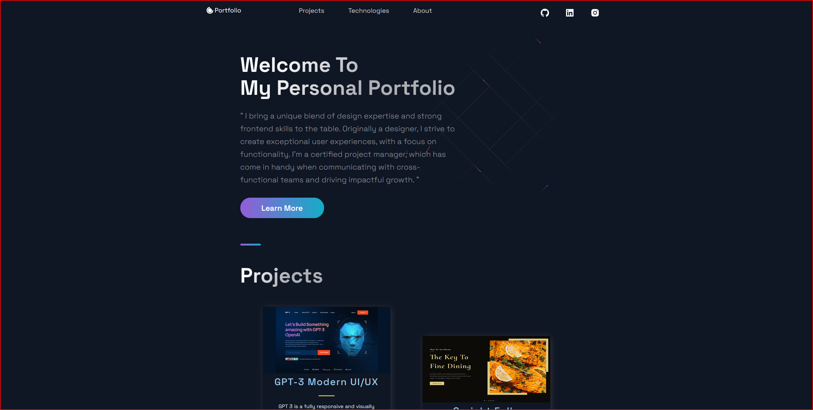

# Personal Portfolio - Welcome to Perrell Shaw

### Description

Welcome to my Portfolio. I am a London Based Frontend Developer working towards becoming a fluent Fullstack Developer. " I bring a unique blend of design expertise and strong frontend skills to the table. Originally a designer, I strive to create exceptional user experiences, with a focus on functionality. I'm a certified project manager, which has come in handy when communicating with cross-functional teams and driving impactful growth. "

### Technology

- Javascript
- Vite
- Reactjs
- PostCSS
- Tailwind CSS
- Babel
- React API

### How to use

### Code Snippet

### Links

For more of my work in design and development visit:

---

---

[Personal Profile](https://perrellshaw.netlify.app/)

# portfolio-site
